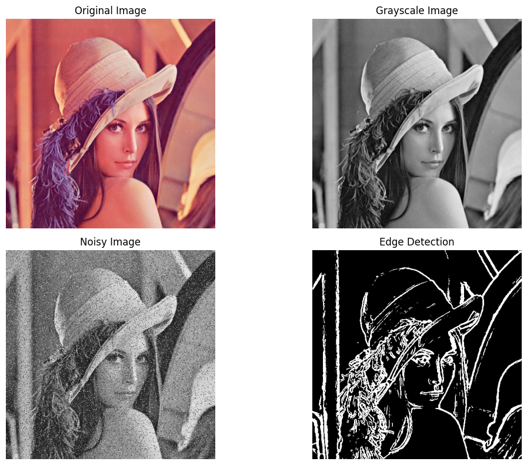
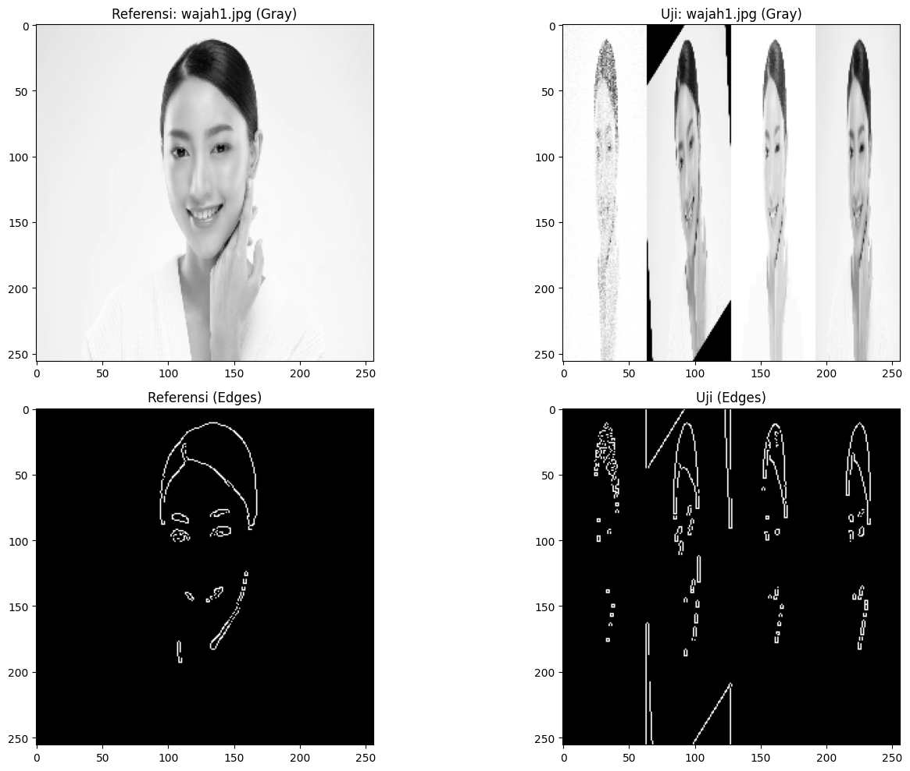
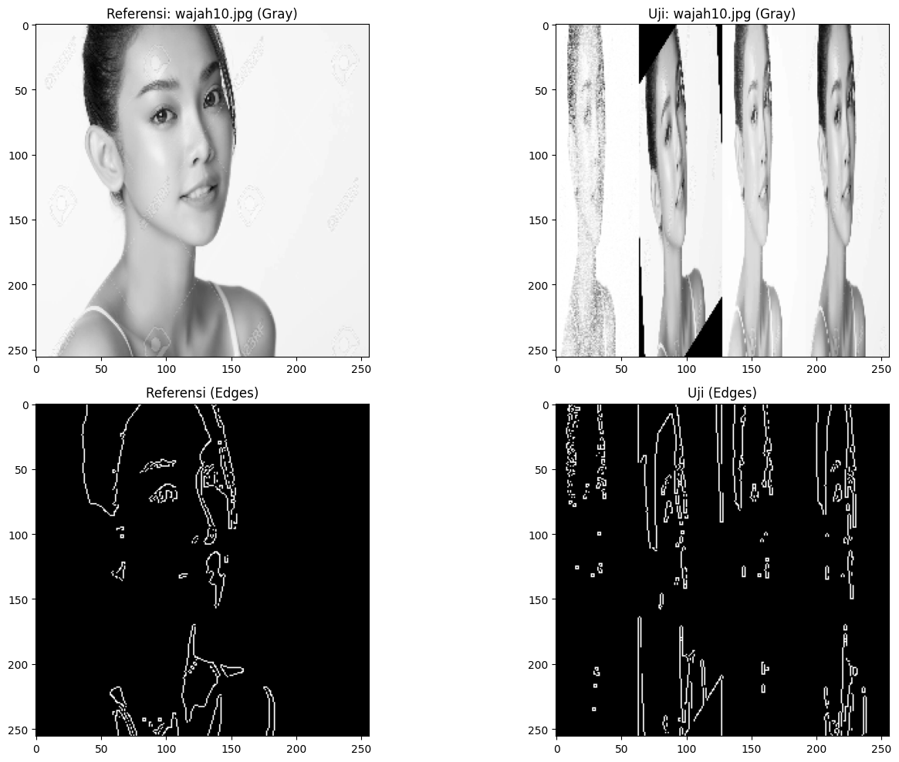
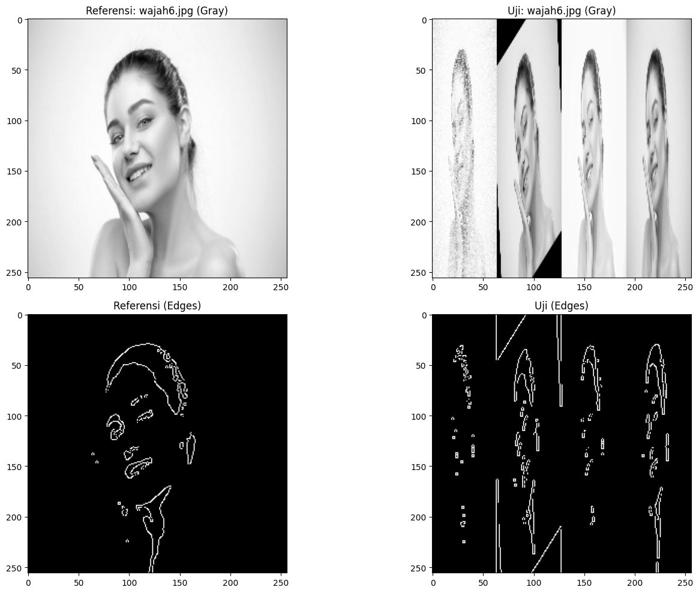
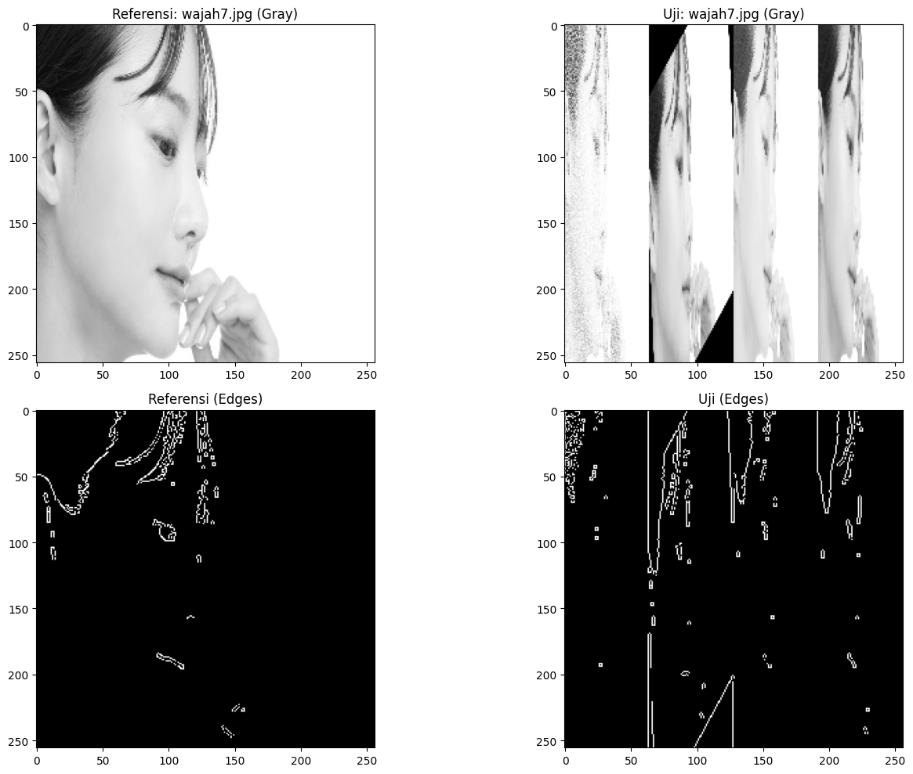
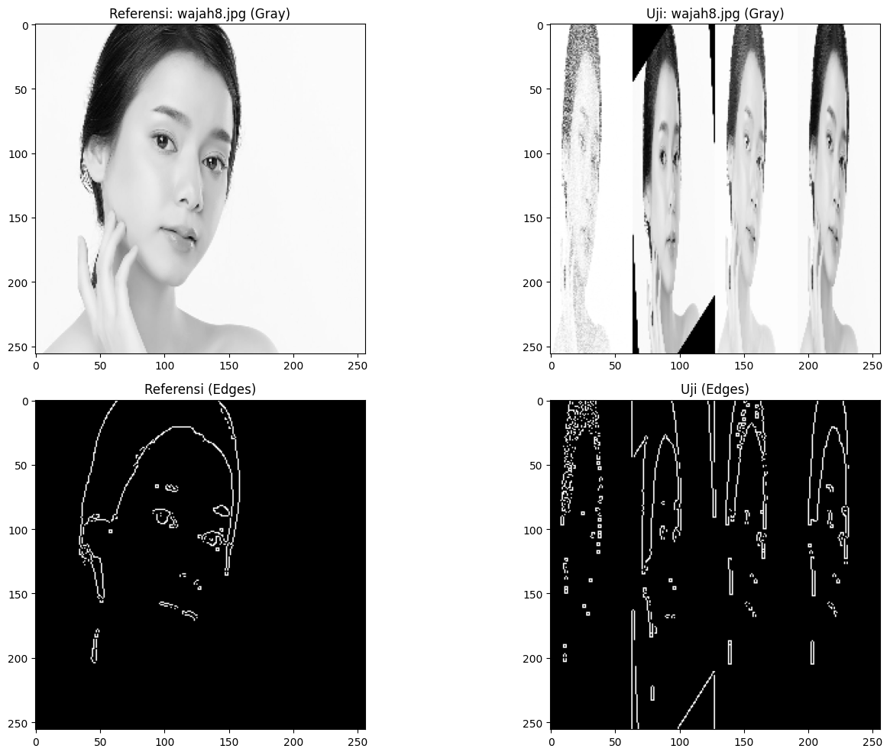
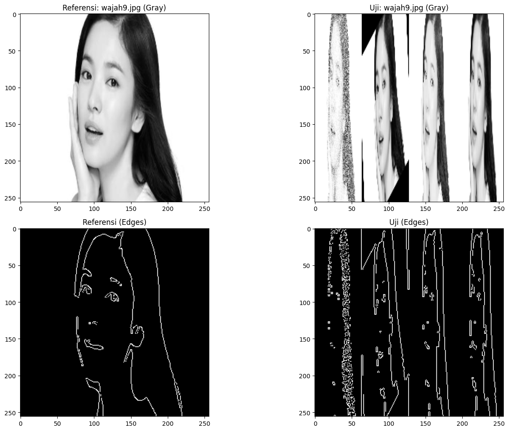
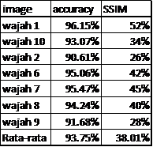

# Pengolahan-Citra-Digital

## Sobel Edge Detection
### Proses Deteksi Tepi
Sebelum mendeteksi tepi pada gambar target, dilakukan beberapa proses pendahuluan.

- Pertama, gambar diubah menjadi **citra abu-abu**, sebagaimana ditunjukkan pada Gambar **Grayscale Image**
- Citra abu-abu ini dihasilkan dari pengolahan gambar asli pada Gambar **Original Image**
- Untuk mensimulasikan noise acak yang sering terjadi dalam proses akuisisi gambar, ditambahkan **noise salt-and-pepper** pada citra abu-abu. Hasilnya ditampilkan dalam bentuk citra pada Gambar **Nioisy Image**.
- Setelah persiapan tersebut selesai, nilai threshold yang telah dihitung untuk digunakan dalam proses deteksi tepi dengan **operator Sobel**. Proses ini menghasilkan citra dengan efek deteksi tepi seperti yang ditunjukkan pada Gambar **Edge Detection**.
  

> Seperti yang ditunjukkan pada Gambar di atas, algoritma ini memiliki kinerja yang sangat baik dalam mendeteksi tepi objek pada gambar meskipun terdapat gangguan noise. Hasil deteksi tepi menunjukkan kontur yang jelas, detail gambar tetap terjaga, dan informasi penting dari gambar tidak hilang. Hal ini membuat gambar dapat digunakan untuk proses lanjutan dengan hasil yang optimal.

### C. Analisis Hasil Eksperimen
Untuk menunjukkan efek deteksi tepi dari algoritma di bawah gambar yang berbeda, dibawah ini membandingkan algoritma dengan algoritma Sobel tradisional dengan threshold yang berbeda pengaturan operator Sobel tradisional dan ambang batas adaptif setiap gambar ditunjukkan pada Gambahar dibawah ini.

## Canny Edge Detection
###
Hasil dati berbagai fase gambar asli wajah, pasangan gambar asli wajah, deteksi tepi canny, segmentasi gambar dan hasil akurasi gambar.

### Segmentasi gambar

### Hasil akurasi

Hasil yang ditemukan dengan menggunakan metode canny edge detection menghasilkan 7 gambar wajah asli. Tingkat keberhasilan rata-rata adalah 93.75%.
